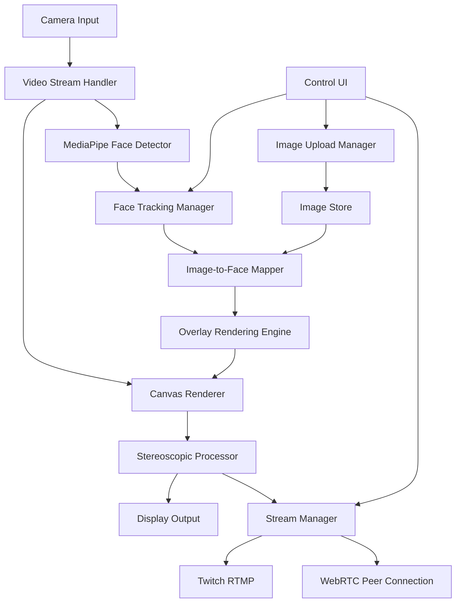
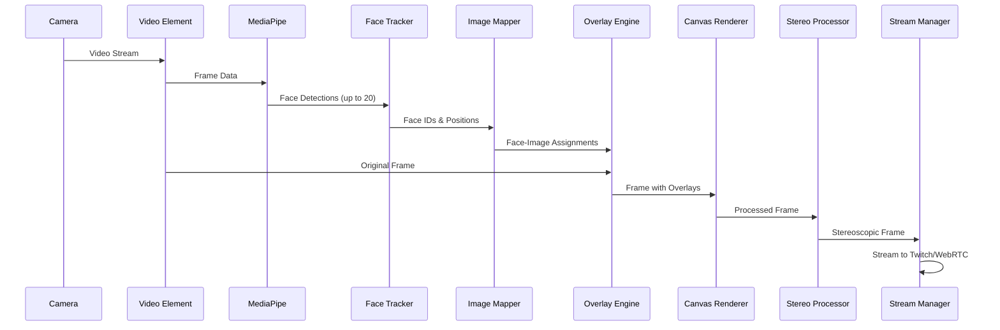

# Face Tracking & Streaming Architecture
## Cloaker4 Enhancement Plan

## Overview
This document outlines the architecture for adding MediaPipe face detection, privacy image overlays, and streaming capabilities to the existing stereoscopic side-by-side VR viewer.

## Core Requirements
1. **Face Detection**: Detect up to 20 faces in real-time using MediaPipe Face Detection
2. **Privacy Overlays**: Replace detected faces with custom images
3. **Image Management**: Upload and manage multiple overlay images
4. **Shuffle Mode**: Randomly assign overlay images to detected faces
5. **Streaming**: Stream stereoscopic output to Twitch and/or WebRTC
6. **Stereoscopic Support**: Maintain side-by-side view for iPhone 0.5x wide-angle camera

---

## System Architecture

### High-Level Component Diagram



### Data Flow



---

## Component Specifications

### 1. MediaPipe Face Detection Integration

**Purpose**: Detect faces in real-time from camera feed

**Technology**: `@mediapipe/face_detection`

**Features**:
- Real-time face detection (30+ fps target)
- Support up to 20 faces simultaneously
- Return bounding box coordinates for each face
- Confidence scoring for detection quality

**Implementation Details**:
```javascript
// FaceDetectionManager.js
class FaceDetectionManager {
  constructor() {
    this.faceDetection = null;
    this.maxFaces = 20;
    this.detectionConfidence = 0.5;
  }
  
  async initialize() {
    // Initialize MediaPipe Face Detection
  }
  
  async detectFaces(videoElement) {
    // Returns array of face detections with bounding boxes
  }
}
```

---

### 2. Face Tracking Manager

**Purpose**: Maintain consistent face identities across frames

**Key Features**:
- Assign unique IDs to detected faces
- Track face positions across frames
- Handle face entry/exit from frame
- Maintain face-to-image mappings

**Data Structure**:
```javascript
{
  faceId: "unique-id",
  boundingBox: { x, y, width, height },
  confidence: 0.95,
  assignedImageId: "image-id",
  firstSeen: timestamp,
  lastSeen: timestamp
}
```

---

### 3. Image Management System

**Purpose**: Upload, store, and manage overlay images

**Features**:
- Upload multiple images (PNG/JPG with transparency support)
- Store images in browser IndexedDB or localStorage
- Image gallery UI for management
- Delete/reorder images
- Preview overlays

**Storage Strategy**:
```javascript
{
  imageId: "unique-id",
  name: "mask-1.png",
  dataUrl: "data:image/png;base64,...",
  dimensions: { width, height },
  uploadedAt: timestamp,
  isActive: true
}
```

---

### 4. Image-to-Face Mapping System

**Purpose**: Assign overlay images to detected faces

**Modes**:
1. **Sequential Mode**: Assign images in order to faces
2. **Random/Shuffle Mode**: Randomly assign images to faces
3. **Fixed Mode**: Assign specific images to specific faces

**Shuffle Algorithm**:
```javascript
class ImageMapper {
  shuffleAssignments(faces, images) {
    // Fisher-Yates shuffle for random assignment
    // Ensure each face gets a unique image when possible
    // Handle more faces than images case
  }
  
  getImageForFace(faceId) {
    // Return assigned image for specific face
  }
  
  reshuffleAll() {
    // Reassign all faces with new random images
  }
}
```

---

### 5. Overlay Rendering Engine

**Purpose**: Draw overlay images onto detected faces

**Process**:
1. Receive face bounding boxes from Face Tracker
2. Get assigned image for each face
3. Scale and position image over face
4. Apply transformations (rotation, scaling)
5. Draw onto canvas

**Canvas Operations**:
```javascript
class OverlayEngine {
  drawOverlay(ctx, face, image) {
    const { x, y, width, height } = face.boundingBox;
    
    // Scale image to fit face with padding
    const scaleFactor = 1.5; // 150% to cover whole head
    
    // Draw with transformations
    ctx.save();
    ctx.translate(x + width/2, y + height/2);
    ctx.scale(scaleFactor, scaleFactor);
    ctx.drawImage(image, -width/2, -height/2, width, height);
    ctx.restore();
  }
}
```

---

### 6. Stereoscopic Integration

**Purpose**: Maintain side-by-side rendering with overlays

**Process**:
1. Apply face detection and overlays to source video
2. Duplicate processed frame for left and right eye
3. Apply any stereo-specific adjustments
4. Render side-by-side to canvas

**Rendering Pipeline**:
```javascript
// StereoRenderer.js
renderStereoFrame(processedFrame) {
  // Left eye
  ctx.drawImage(processedFrame, 0, 0, halfWidth, height);
  
  // Right eye (duplicate for now, future: parallax)
  ctx.drawImage(processedFrame, halfWidth, 0, halfWidth, height);
  
  // Center divider
  ctx.fillRect(halfWidth - 1, 0, 2, height);
}
```

---

### 7. Streaming System

**Purpose**: Stream processed stereoscopic output to Twitch and WebRTC

#### 7.1 Twitch Streaming (RTMP)

**Technology**: 
- Canvas MediaStream Capture API
- WebRTC to RTMP bridge (backend required)
- OR use OBS Virtual Camera alternative

**Architecture**:


**Backend Component** (Node.js):
```javascript
// backend/rtmpBridge.js
// Receives WebRTC stream from browser
// Re-encodes with FFmpeg
// Pushes to Twitch RTMP endpoint
```

#### 7.2 WebRTC Streaming

**Technology**: Simple Peer or native WebRTC

**Use Cases**:
- Peer-to-peer streaming to viewers
- Local network streaming
- Recording/monitoring

**Implementation**:
```javascript
class WebRTCStreamer {
  constructor(canvasElement) {
    this.stream = canvasElement.captureStream(30); // 30 fps
  }
  
  startPeerConnection(config) {
    // Create RTCPeerConnection
    // Add canvas stream tracks
    // Handle signaling
  }
}
```

---

## Technical Stack Additions

### Frontend Dependencies
```json
{
  "@mediapipe/face_detection": "^0.4.0",
  "@mediapipe/camera_utils": "^0.3.0",
  "simple-peer": "^9.11.1",
  "socket.io-client": "^4.5.0"
}
```

### Backend Dependencies (New Node.js Server)
```json
{
  "express": "^4.18.2",
  "socket.io": "^4.5.0",
  "fluent-ffmpeg": "^2.1.2",
  "ws": "^8.13.0"
}
```

---

## Implementation Phases

### Phase 1: Face Detection Core
- [ ] Install MediaPipe dependencies
- [ ] Create FaceDetectionManager component
- [ ] Integrate with existing video stream
- [ ] Display bounding boxes for detected faces
- [ ] Test detection performance and accuracy

### Phase 2: Image Management
- [ ] Build image upload UI component
- [ ] Implement IndexedDB storage for images
- [ ] Create image gallery with preview
- [ ] Add delete/reorder functionality
- [ ] Handle image loading and caching

### Phase 3: Face Tracking & Mapping
- [ ] Implement Face Tracking Manager
- [ ] Build Image-to-Face Mapper
- [ ] Create shuffle algorithm
- [ ] Add manual assignment UI
- [ ] Test face identity persistence

### Phase 4: Overlay Rendering
- [ ] Create Overlay Rendering Engine
- [ ] Integrate with canvas rendering pipeline
- [ ] Add scaling and positioning logic
- [ ] Optimize rendering performance
- [ ] Test with multiple simultaneous faces

### Phase 5: Stereoscopic Integration
- [ ] Update canvas renderer for overlays
- [ ] Ensure side-by-side view maintains overlays
- [ ] Test with iPhone camera feed
- [ ] Optimize for mobile performance

### Phase 6: Streaming Setup
- [ ] Create backend streaming server
- [ ] Implement canvas stream capture
- [ ] Build RTMP bridge for Twitch
- [ ] Add WebRTC peer connections
- [ ] Create streaming control UI

### Phase 7: Polish & Testing
- [ ] Performance optimization
- [ ] UI/UX improvements
- [ ] Error handling and recovery
- [ ] Mobile device testing
- [ ] End-to-end streaming tests

---

## Performance Considerations

### Target Metrics
- **Face Detection**: 30+ fps
- **Overlay Rendering**: 60 fps target
- **Total Latency**: < 100ms for camera to canvas
- **Streaming**: 30 fps stable stream

### Optimization Strategies

1. **Use Web Workers for Face Detection**
   - Offload MediaPipe processing to worker thread
   - Keep main thread for rendering

2. **Image Caching**
   - Pre-load all overlay images
   - Use OffscreenCanvas for image processing

3. **Efficient Canvas Operations**
   - Minimize save/restore operations
   - Use requestAnimationFrame wisely
   - Clear only dirty regions when possible

4. **Adaptive Quality**
   - Reduce detection frequency on low-end devices
   - Lower streaming quality if performance drops
   - Skip frames intelligently

5. **Memory Management**
   - Limit image size (max 1MB per overlay)
   - Use image compression
   - Clean up unused resources

---

## Privacy & Security Considerations

1. **Local Processing**: All face detection happens client-side
2. **No Face Data Storage**: Face positions not stored, only temporary mappings
3. **Image Storage**: User-uploaded images stored locally (IndexedDB)
4. **Streaming Privacy**: Users control when streaming starts/stops
5. **HTTPS Required**: For camera access and security

---

## UI/UX Design

### Main Controls Panel
```
┌─────────────────────────────────────┐
│  StereoCam VR - Face Privacy Mode   │
├─────────────────────────────────────┤
│                                     │
│  Face Detection:  [ON] [OFF]        │
│  Faces Detected:  5 / 20            │
│                                     │
│  Overlay Mode:                      │
│    ○ Sequential                     │
│    ● Random/Shuffle  [Reshuffle]    │
│    ○ Manual Assign                  │
│                                     │
│  [📁 Manage Images (12)]            │
│                                     │
│  Streaming:                         │
│    [🟣 Stream to Twitch]            │
│    [🔴 Start WebRTC Stream]         │
│                                     │
└─────────────────────────────────────┘
```

### Image Gallery Modal
```
┌─────────────────────────────────────┐
│  Overlay Image Gallery      [+ Add] │
├─────────────────────────────────────┤
│  ┌─────┐ ┌─────┐ ┌─────┐ ┌─────┐   │
│  │ img1│ │ img2│ │ img3│ │ img4│   │
│  └─────┘ └─────┘ └─────┘ └─────┘   │
│  [✓] [x] [✓] [x] [✓] [x] [✓] [x]   │
│                                     │
│  ┌─────┐ ┌─────┐ ┌─────┐           │
│  │ img5│ │ img6│ │ img7│           │
│  └─────┘ └─────┘ └─────┘           │
│  [✓] [x] [✓] [x] [✓] [x]           │
└─────────────────────────────────────┘
```

---

## File Structure

```
frontend/
├── src/
│   ├── components/
│   │   ├── VRCameraViewer.js (existing - update)
│   │   ├── FaceDetection/
│   │   │   ├── FaceDetectionManager.js
│   │   │   ├── FaceTracker.js
│   │   │   └── DebugOverlay.js
│   │   ├── ImageManagement/
│   │   │   ├── ImageUploader.js
│   │   │   ├── ImageGallery.js
│   │   │   ├── ImageStore.js
│   │   │   └── ImagePreview.js
│   │   ├── Overlay/
│   │   │   ├── OverlayEngine.js
│   │   │   ├── ImageMapper.js
│   │   │   └── ShuffleController.js
│   │   ├── Streaming/
│   │   │   ├── StreamManager.js
│   │   │   ├── TwitchStreamer.js
│   │   │   ├── WebRTCStreamer.js
│   │   │   └── StreamControls.js
│   │   └── UI/
│   │       ├── ControlPanel.js
│   │       ├── FaceCounter.js
│   │       └── StatusIndicator.js
│   ├── hooks/
│   │   ├── useFaceDetection.js
│   │   ├── useImageManager.js
│   │   └── useStreaming.js
│   └── utils/
│       ├── canvasUtils.js
│       ├── imageProcessor.js
│       └── performanceMonitor.js
│
backend/
├── server.js (new)
├── rtmpBridge.js (new)
├── webrtcSignaling.js (new)
└── package.json (new)
```

---

## Next Steps

1. **Review & Approve Architecture**: Ensure this design meets your requirements
2. **Prioritize Features**: Decide implementation order
3. **Set Performance Targets**: Define acceptable performance metrics
4. **Choose Streaming Approach**: Decide between Twitch-only, WebRTC-only, or both
5. **Begin Phase 1 Implementation**: Start with face detection core

---

## Questions for Clarification

1. **Image Format**: Should overlay images support transparency (PNG)?
2. **Image Size Limits**: Max file size and dimensions for overlay images?
3. **Streaming Priority**: Twitch or WebRTC more important initially?
4. **Backend Hosting**: Where to host the streaming backend (Render, AWS, etc.)?
5. **Face Tracking Persistence**: Should face IDs persist across sessions?
6. **Performance vs Quality**: Prefer lower latency or higher quality?

---

## Cost & Resource Estimates

### Development Time
- Phase 1-2: 2-3 days (face detection + image management)
- Phase 3-4: 2-3 days (tracking + overlay)
- Phase 5: 1 day (stereo integration)
- Phase 6: 3-4 days (streaming setup)
- Phase 7: 2 days (polish + testing)
- **Total**: ~10-15 days for full implementation

### Infrastructure Costs
- **Frontend Hosting**: Existing (Render static site - free tier)
- **Backend Streaming Server**: $7-15/month (Render web service or similar)
- **Twitch**: Free to stream
- **Bandwidth**: Depends on viewer count

---

*Document Version: 1.0*  
*Last Updated: 2025-11-12*